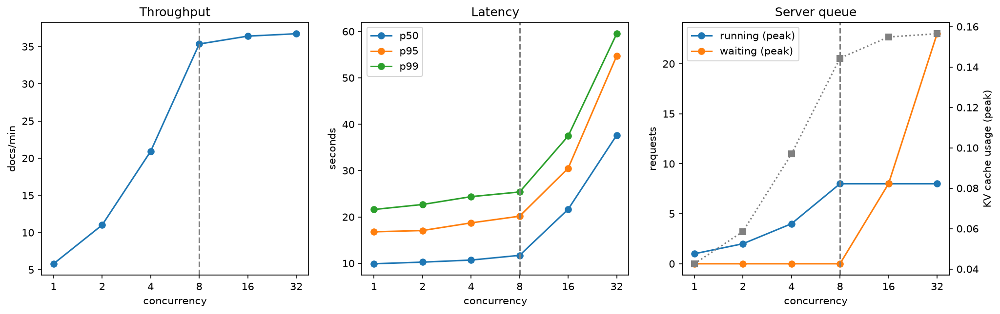

# Self-hosted document extraction: what does keeping the model in-house cost?

A company that cannot send customer documents to a third-party API has to serve the model
itself. This project answers what that costs in throughput, latency, accuracy and money. It
self-hosts an open vision-language model (Qwen3-VL) with vLLM on a rented L4 GPU, measures four
serving configurations, and compares the result with Azure AI Document Intelligence.

Receipt extraction is the workload. The serving measurement is the point.

<!-- After recording, put the demo GIF at docs/demo.gif and uncomment the next line:

-->

## The result

Two model sizes times two visual-token budgets, each run as its own vLLM launch on one Modal L4
(vLLM 0.21.0, `--max-num-seqs 8`), accuracy scored on 100 CORD test receipts and load swept
across concurrency 1 to 32.

| Config | Visual tokens/doc | CORD F1 | Peak docs/min | p95 @ peak | $/1k docs |
|---|---|---|---|---|---|
| 4B, default res | 2104 | 0.819 | 24.5 | 53.5 s | $0.54 |
| **4B, reduced res** | 973 | **0.833** | 36.7 | 54.7 s | $0.36 |
| 2B, default res | 2104 | 0.652 | 58.6 | 21.0 s | $0.23 |
| 2B, reduced res | 968 | 0.670 | **66.3** | 18.7 s | **$0.20** |

**For up to about 35 docs/min sustained (roughly 50,000 receipts a day) with a p95 budget near
20 s, run 4B with reduced resolution.** At 8 concurrent requests it does 35.4 docs/min at a
20.2 s p95, matches the default-resolution F1 (0.833 against 0.819) and costs a third less per
document. The default resolution was spending GPU time the task did not need.

Cost is USD at Modal's published L4 rate ($0.000222/s), assuming the GPU is fully busy. F1 is
scored on the 94 receipts that scored cleanly under all four configs. Full write-up:
[`benchmarks/results/phase6_writeup.md`](benchmarks/results/phase6_writeup.md).



The curve bends at concurrency 8, the `--max-num-seqs` limit, in all four configs. Requests
9 and up wait in vLLM's queue (right panel), so throughput flattens while p95 climbs. Model
size does not move the knee. It only changes how much work each of the 8 slots carries. Other
curves: [4B default](benchmarks/results/phase6_4b_default_20260926T162034Z_curves.png),
[2B default](benchmarks/results/phase6_2b_default_20260926T191929Z_curves.png),
[2B reduced](benchmarks/results/phase6_2b_cap1500k_20260926T202437Z_curves.png).

## Versus a managed service

Azure AI Document Intelligence (`prebuilt-receipt`) and the 4B reduced-res model, both
single-shot, on the 347-receipt SROIE test split, scored on company, address, date and total.

| System | Overall F1 | company | address | date | total | Answered all fields | p50 | $/1k docs |
|---|---|---|---|---|---|---|---|---|
| Self-hosted 4B | **0.914** | **0.925** | **0.939** | 0.965 | 0.826 | 345 / 347 | 3.9 s | **$0.91** |
| Azure DI | 0.868 | 0.816 | 0.743 | **0.986** | **0.927** | 326 / 347 | 3.8 s | $10.00 |

Self-hosted is about 11 times cheaper and never came back empty. DI returned no total on 15
receipts and a wrong negative total on 4. DI is better at date and total, the fields its typed
extraction is built for. Two receipts have a negative gold total and are excluded for both
systems. Details, and how two scoring mistakes were found and fixed:
[`benchmarks/results/phase8_writeup_v2.md`](benchmarks/results/phase8_writeup_v2.md).

## What the project found

- **A local GPU was never an option.** Qwen3-VL's vision tower only accepts FlashAttention-class
  attention backends, which need compute capability 8.0 or higher. On a Turing card (GTX 1650,
  free Kaggle and Colab T4s) it fails at load, no matter how much memory the card has. "Supported
  by vLLM" means the architecture is implemented, not that a kernel exists for your GPU. All model
  work runs on Modal's Ada-class L4; local development uses a mocked client.
- **The resolution knob everyone copies does nothing.** `max_pixels` in `--mm-processor-kwargs`
  is silently ignored by Qwen3-VL on vLLM 0.21.0. The real knob is `size.longest_edge`. The
  odd "encoder cache ceiling" that rejected 17 receipts disappeared once the dead flag was
  removed. Why an ignored flag broke large requests was never root-caused.
- **More pixels were not more signal.** Cutting visual tokens by more than half raised F1 on
  both model sizes.
- **Model size is the big cost lever.** At default resolution 2B has 2.4 times the throughput of
  4B and loses about 0.16 F1, mostly on a few count fields; the total field holds up much better.
- **A load generator can measure itself.** At concurrency 32 the client's own upload path, not
  the GPU, was the likely bottleneck for large base64 payloads.
- **Evaluation choices moved the headline twice.** A character-level address match and a strict
  date parser each hid or invented a gap between the two systems, and the corrected numbers
  above replace the first ones.

## Architecture

```
  laptop (CPU only)                Modal (L4, scales to zero)          Azure
  pipeline, schemas, tests   -->   vLLM + Qwen3-VL 4B / 2B      <--    Container Apps: FastAPI
  mocked client                    OpenAI-compatible API                Blob (24 h), Key Vault,
                                   weights in a Modal Volume            App Insights, ACR
                                                                        Document Intelligence
```

The app tier never loads a model. `extraction/client.py` is the single seam: the same pipeline
runs against a mock locally, a Modal endpoint during measurement, and the deployed service.

- **API:** `POST /extract` needs an API key and is rate limited; uploads go to Blob with a 24 h
  lifecycle policy. Secrets live in Key Vault behind a managed identity, and CI deploys through
  GitHub OIDC with no stored credential.
- **Public demo page:** `GET /demo` shows ten cached samples side by side with DI and lets a
  visitor wake the GPU and try one receipt. It has no key, so cost is capped in layers: per-IP
  limits, a daily request cap, a monthly spend ledger stored in Blob that fails closed, and no
  route that wakes the GPU except an explicit, ledger-charged one. Uploads there are not stored.
  The live deployment is taken down after the demo is recorded to avoid idle cost.

## Reproduce

```
uv sync --extra dev
uv run pytest                       # no GPU needed; the vLLM client is mocked
uv run ruff check src tests
uv run python benchmarks/build_table.py         # Phase 6 table from committed results
uv run python benchmarks/build_sroie_table.py   # SROIE comparison from committed captures
```

Serving runs need a Modal account (`modal_app.py`, then `benchmarks/measure.py`); the DI run
needs an Azure Document Intelligence resource. Result files carry the vLLM version, which is
pinned in `pyproject.toml`.

## Layout

```
modal_app.py            vLLM server on Modal (flags are the experiment)
src/docintel/
  schemas.py            the contract: Receipt (CORD), SroieReceipt (4 fields)
  extraction/           prompts, client seam, pipeline, business rules, repair loop
  eval/                 CORD and SROIE loaders, normalisation, field-level scoring
  baseline.py           Azure Document Intelligence client
  api.py, demo.py       FastAPI app and the public demo page
  ledger.py             monthly GPU-spend cap for the demo
benchmarks/             load generator, 4-config orchestrator, table builders, results
infra/                  the az commands behind the Azure deployment
tests/                  unit tests plus mocked integration tests
```

## Limits worth knowing

- One sample per receipt and per system at vLLM's default sampling temperature, no repeated
  trials. Differences of a point or two are inside the noise.
- The 2B runs include runaway generations because no request sets `max_tokens`, so its latency
  is somewhat pessimistic.
- The resolution axis only touched the heaviest 23% of receipts. Whether much tighter caps hurt
  small print was not tested.
- DI was run on SROIE only, deliberately: running it on the Indonesian CORD set would flatter
  the self-hosted side for reasons unrelated to capability.
- Costs are in USD; no sourced EUR rate is used anywhere.
